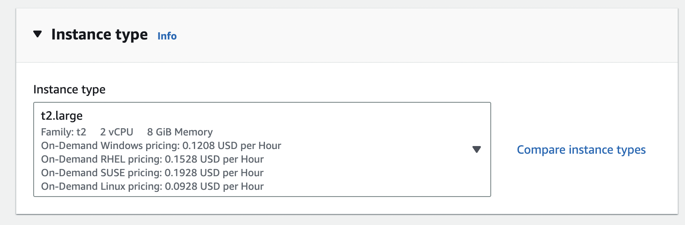
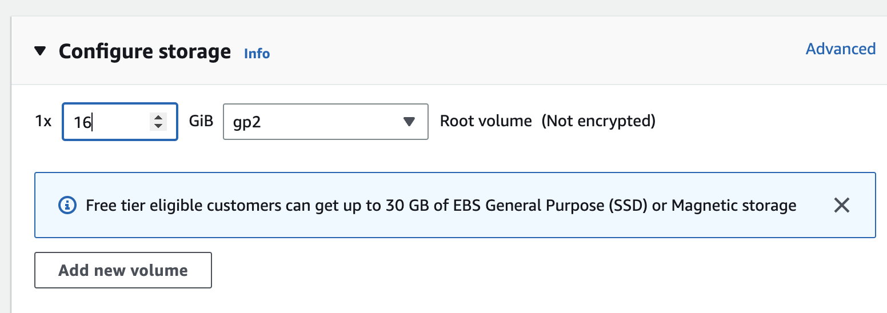
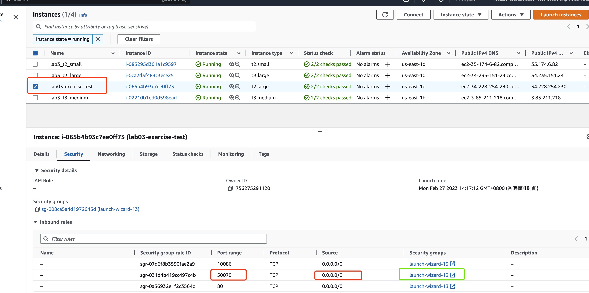
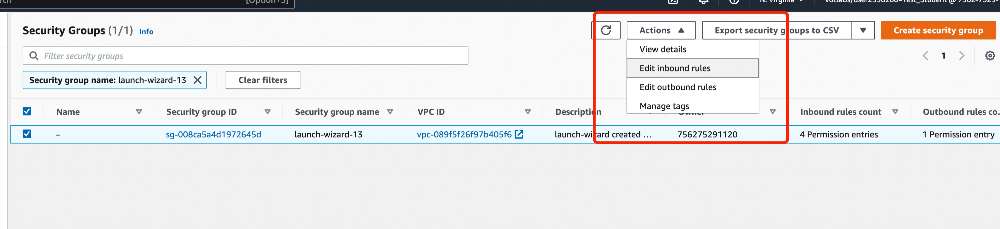
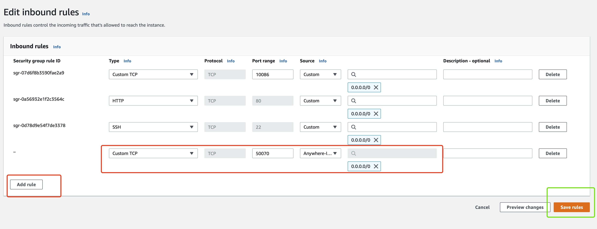

# COMP4651 Exercise-1

This is a code Exercise of COMP 4651 23' Spring. We'll get familiar with HDFS through some coding. This exercise **DOSE NOT** account for any marks, but we strongly recommand you go through the codes and get familiar with it. Please follow the instructions in lab 03, on Feb 28.

## Environment Setup

### Docker Installation
First, follow the prerequisites according to pg.3 of the [slides](./files/lab03_Hadoop.pdf) to install and set up docker deamon. Make sure docker deamon is properly started on your device. (It would require at least 2GB of free memory to start, if you don't have enough space locally, follow the appendix to launch aws instance)

### <span id="jump1">Pull Docker Image</span>
After starting docker deamon, you'll need to download the docker image we've packaged for you with Hadoop service already configured with the following command:
``` bash
$ docker pull qpswwww/quickstarts:v0
```

### Code Cloning
Also you'll need to clone this repo. In particular, you may create a directory called `comp4651` in the home folder: `mkdir comp4651`. You can `cd` into that directory and then `git clone` the exercise repo, which will download the sample and skeleton code to your device.

### Run your Container
Then you nee to start a container based on the docker image we've downloaded. We're enabling shared folder so that you can modify the code on your device and run in docker container (remember to **REPLACE** YOUR_CODING_FOLDER with the absolute directory on your device):
``` bash
$ sudo docker run --hostname=quickstart.cloudera --restart unless-stopped --privileged=true -it -v YOUR_CODING_FOLDER:/share -p 8888:8888 -p 80:80 -p 8020:8020 -p 7180:7180 -p 50070:50070 -p 10086:22 qpswwww/quickstarts:v0 /bin/bash
```

You can use `ctrl+d` to exist the container. To re enter, use the following commands:
``` bash
# This enables you to check the running container on your device, you can get the container id and enter to a specific container.
$ docker container ls
# Use the container id you got in the next command
$ sudo docker exec -it YOUR_CONTAINER_ID /bin/bash
```

### Restart Service
Use the following command to restart the service we already deployed:​
``` bash
$ sudo service hadoop-yarn-resourcemanager restart

$ sudo service hadoop-hdfs-namenode restart

$ sudo service hadoop-hdfs-datanode restart
```
**Always restart the service when starting container from a docker image**.

Now that you have the Hadoop services ready.

## HDFS APIs

In this exercise, you will write a simple code that copies a file from HDFS to the local disk, using HDFS APIs. Please follow these instructions carefully!

This repo is generated using [Apache Maven][Maven], a software project management and comprehension tool. If you examine the structure of the repo using `tree Exercise-1-yourGitHubHandle`, you'll find a `pom.xml` file in the root directory (which tells [Maven][Maven] how to build the code) and a source folder `src/`. Inside `src/`, there are two sub-directories, one for the main source code (`main/`) and another for the test code (`test/`). The test code is nothing but a place holder and will not be used in this exercise. The "meat" locates in the source folder, where you'll find three Java class files: `CopyFile.java` (which copies a file in a specified filesystem to another), `CopyLocalFile.java` (which copies a local file to HDFS), and `FileSystemCat.java` (which prints out the file contents). The latter two are complete example code that are well documented, while `CopyFile.java` is just a *skeleton* that has not been implemented.

> While we recommend using Docker as the experimental platform, there can be other options, including VirtualBox, VMware VM and KVM VM. Please note that additional configurations may be required if you choose to use other platforms.

**Your job is to complete the skeleton** `CopyFile.java` **with which your can copy a file from HDFS to a local disk.**

To try out the sample code, let's `cd` into the `exercise-1-yourGitHubHandle` folder under which `pom.xml` is located. You can now build the Maven project and package it to a jar file with the following command:
``` bash
$ mvn clean package --settings settings.xml
```
Once the build succeeds, you should be able to run the two samples. Let's first copy a local file to HDFS:
``` bash
$ hadoop jar target/exercise-1-1.0-SNAPSHOT.jar hk.ust.comp4651.CopyLocalFile hkust.txt hkust.txt
```
You will find a copy of `hkust.txt` file in HDFS:
``` bash
$ hadoop fs -ls
```
You can now print out the contents of this file in HDFS:
``` bash
$ hadoop jar target/exercise-1-1.0-SNAPSHOT.jar hk.ust.comp4651.FileSystemCat hkust.txt
```
The output should match the local copy: `cat hkust.txt`.

Now it's time to examine the two example code in details and complete your `CopyFile.java`. After you are done, you can build the Maven project with `mvn clean package` and do some tests. For example, you can copy back `hkust.txt` from HDFS to the local disk:
``` bash
$ export LOCAL_DIR=file:///`pwd`
$ hadoop jar target/exercise-1-1.0-SNAPSHOT.jar hk.ust.comp4651.CopyFile hkust.txt $LOCAL_DIR/cp-hkust.txt
```
> The default filesystem is HDFS. If your want to refer to a local filesystem, you need to specify a prefix `file:///` before a file path.

If your implementation is correct, you will find a `cp-hkust.txt` file in your current directory, with the same contents as `hkust.txt`. You can try to copy other files for further tests.

When you are done, make sure you have committed your code and pushed the repo back to origin.


## Appendix
We also provides you with aws ec2 instances for running docker deamon in case you got some unsolvable problem on your local device (basically on windows machines)

### Launch EC2 Instance
Firstly we need to launch a EC2 instance which will handle the docker service. 
To achieve this, you will need to launch a EC2 instance through AWS learner Lab, which could be quite familiar for you.

Here you'll need to luanch an instance of **t2.large** and choose **16GB** volume, as shown below:




You are now ready to launch your instance.


## Modify Security Group 
After successfully launched your instance, you should be able to connect through ssh and after adding the configurations in `~/.ssh/config`, you will be able to play with the code inside with the IDE you are familiar with.(e.g., with [VSCode Remote ssh](https://code.visualstudio.com/docs/remote/ssh))
Also, you should follow the instructions: [Installing Docker on Amazon Linux 2](https://docs.aws.amazon.com/AmazonECS/latest/developerguide/create-container-image.html) to install and activate docker on this instance.

Before getting back to the regular routine, one important thing you should also complete is to modify the security group of your instance so that you can access to Hadoop Web UI from your local device.

Go to the instance page and finde your ec2 instance (e.g., in this case *lab03-exercise-test*), make sure you hopen the TCP access of port **50070** which is the Hadoop web UI port.


If not, press the corresponding security group, which is in the green box, press Actions and Edit inbound rules.

Then add a rule as shown below, save rules, you will be ready to start again from [here](#jump1)!



[Maven]: https://maven.apache.org

